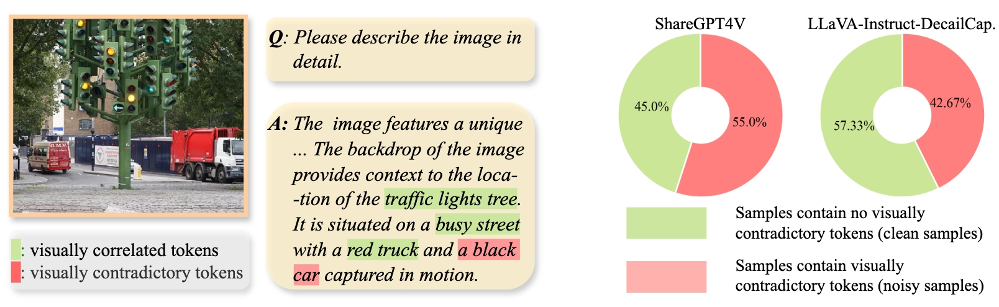
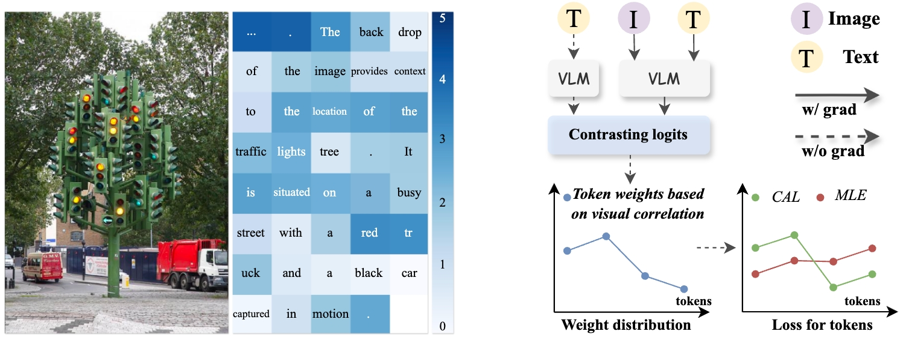
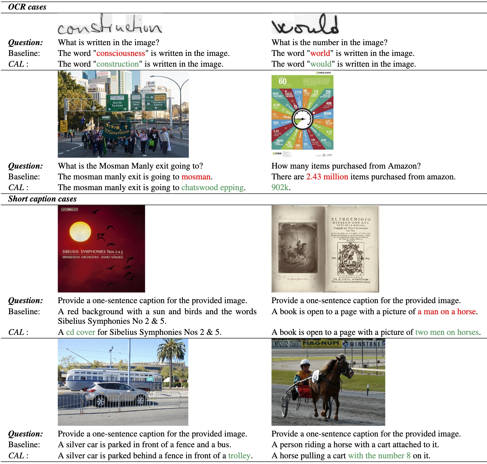

# 👁️ Seeing the Image: Prioritizing Visual Correlation by Contrastive Alignment

## All codes will be released after approval.

This is an official PyTorch Implementation of [**Seeing the Image: Prioritizing Visual Correlation by Contrastive Alignment**]()

[Xin Xiao*](https://scholar.google.com/citations?user=CL-ZEdwAAAAJ&hl=zh-CN), [Bohong Wu*](https://scholar.google.com/citations?user=N6vypvkAAAAJ&hl=en), Jiacong Wang, [Chunyuan Li](https://chunyuan.li/), Xun Zhou, [Haoyuan Guo](https://scholar.google.com/citations?hl=en&user=hql67boAAAAJ&view_op=list_works&sortby=pubdate) (*Equal Contribution)

>**abstract:**
>Existing image-text modality alignment in Vision Language Models (VLMs) treats each text token equally in an autoregressive manner. Despite being simple and effective, this method results in sub-optimal cross-modal alignment by over-emphasizing the text tokens that are less correlated with or even contradictory with the input images. In this paper, we advocate for assigning distinct contributions for each text token based on its visual correlation. Specifically, we present by contrasting image inputs, the difference in prediction logits on each text token provides strong guidance of visual correlation. We therefore introduce **C**ontrastive **AL**ignment (CAL), a simple yet effective re-weighting strategy that prioritizes training visually correlated tokens. Our experimental results demonstrate that CAL consistently improves different types of VLMs across different resolutions and model sizes on various benchmark datasets. Importantly, our method incurs minimal additional computational overhead, rendering it highly efficient compared to alternative data scaling strategies.

<p align="center"></p>
<p align="center"></p>

[](https://github.com/tatsu-lab/stanford_alpaca/blob/main/LICENSE)
**Usage and License Notices**: This project utilizes certain datasets and checkpoints that are subject to their respective original licenses. Users must comply with all terms and conditions of these original licenses, including but not limited to the [OpenAI Terms of Use](https://openai.com/policies/terms-of-use) for the dataset and the specific licenses for base language models for checkpoints trained using the dataset (e.g. [Llama community license](https://ai.meta.com/llama/license/) for LLaMA-2 and Vicuna-v1.5). This project does not impose any additional constraints beyond those stipulated in the original licenses. Furthermore, users are reminded to ensure that their use of the dataset and checkpoints is in compliance with all applicable laws and regulations.

<!-- ## News and Updates
* ```2024.05``` 🔥🔥🔥 Code released. -->

## Selected Examples
<p align="center"></p>

## Results
We provide results comparision for LLaVA-NEXT here. 

| Method            | LLM           | OCRB. | VQA<sup>Doc</sup> | VQA<sup>Chart</sup> | VQA<sup>Text</sup> | SQA  | MMS. | MMT. | Win/All |
|-------------------|---------------|-------|---------|-----------|----------|------|------|------|---------|
| LLaVA-NeXT        | Vicuna-7B     | 542   | 75.1    | 62.2      | 64.2     | 68.5 | 33.7 | 49.5 |    |
| LLaVA-NeXT+CAL    | Vicuna-7B     | **561** | **77.3** | **64.3** | **65.0** | **70.1** | **35.5** | **50.7** | 7 / 7   |
| LLaVA-NeXT        | Vicuna-13B    | 553   | 78.4    | 63.8      | 67.0     | **71.8** | 37.5 | 50.4 |   |
| LLaVA-NeXT+CAL    | Vicuna-13B    | **574** | **80.1** | **67.2** | **67.1**     | 71.5 | **38.1** | **52.4** | 6 / 7   |


| Method              | LLM           | COCO Caption | TextCaps | Refcocog_val | Refcocog_test | Win/All |
|---------------------|---------------|--------------|----------|--------------|---------------|---------|
| LLaVA-NeXT          | Vicuna-7B     | 112.0        | 115.0    | 77.6         | 77.5          |   |
| LLaVA-NeXT+CAL      | Vicuna-7B     | **114.7**    | **124.7**| **78.4**     | **78.1**      | 4 / 4   |
| LLaVA-NeXT          | Vicuna-13B    | 118.5        | 118.2    | 79.8         | 79.6          |    |
| LLaVA-NeXT+CAL      | Vicuna-13B    | **120.6**    | **124.4**| **80.4**     | **80.3**      | 4 / 4   |

## Install
```bash
conda create -n CAL python=3.10 -y
conda activate CAL
bash install.sh
```

## Dataset
Please follow the instruction in [LLaVA](https://github.com/haotian-liu/LLaVA) to prepare data.

For customized data preparation, please refer to [this guide](docs/Finetune_Custom_Data.md).

## Training

You can execute demo bash scripts in this [directory](./run_scripts) to train LLaVA models.

### 1. Customize base settings
Before training, **you need to customize some settings in the following table**. Otherwise, the code will use the default paths specified in [run.sh](LLaVA/scripts/general/run.sh). **When using multiple data sources, simply concatenate their paths with a space**.


| Setting            | Usage                                         |
|--------------------|-----------------------------------------------|
| `base_dir`         | Path saving root directory                    |
| `exp_name`         | Experiment name, associated with the saving path |
| `pretrain_json`    | Pretrain JSON data                            |
| `pretrain_imagedir`| Pretrain data image directory                 |
| `finetune_json`    | Finetune JSON data                            |
| `finetune_imagedir`| Finetune data image directory                 |

For developers who cannot access Hugging Face directly, you can download the checkpoint files (modelscope) and modify the LLM path to the absolute path.

### 2. Running
For example, to train LLaVA-NEXT with the Vicuna-13B LLM, run:

```bash
bash run_scripts/llava16_7b.sh
```

Note: The code will dynamically calculate the batch size for each GPU according to the total_batchsize, grad_acumsteps and the number of GPUs. When your resourses are limited, you can reduce total_batchsize or set a larger grad_acumsteps in the settings.

$batchsize_{singleGPU} = batchsize_{total}/(grad\_{acumsteps}*GPU\_{num})$

For multinode training, you need to prepare a hostfile. We provide an [example](./hostfile.txt) here. Customize it based on your environment.


## Evaluation

We evaluate our model using [lmms-eval](https://github.com/EvolvingLMMs-Lab/lmms-eval). This tool is quick and easy to use, requiring no dataset preparation. For more details, please refer to the lmms-eval repository.

## Customization

The core modifications primarily involve three files:

1. `llava/constants.py`
2. `llava/model/llava_arch.py`
3. `llava/model/language_model/llava_llama.py`

You can run CAL by modifying the corresponding files in LLaVA-style codebase, like [MGM](https://github.com/dvlab-research/MGM).

## Acknowledgement

- [LLaVA](https://github.com/haotian-liu/LLaVA): the codebase we built upon.
- [lmms-eval](https://github.com/EvolvingLMMs-Lab/lmms-eval): the codebase we evaluate our model.

Thanks a lot for their great works.

## Citation
```bibtex
@inproceedings{}
```


